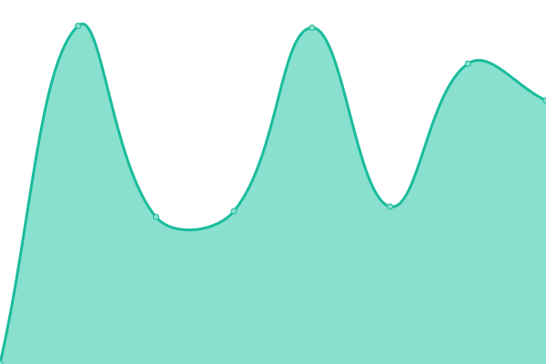
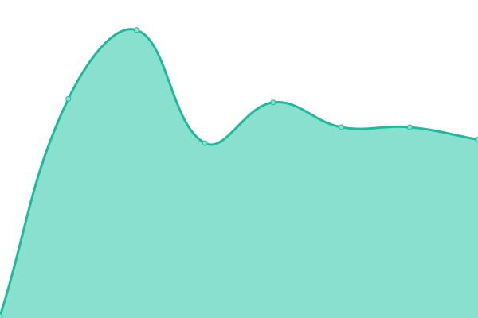
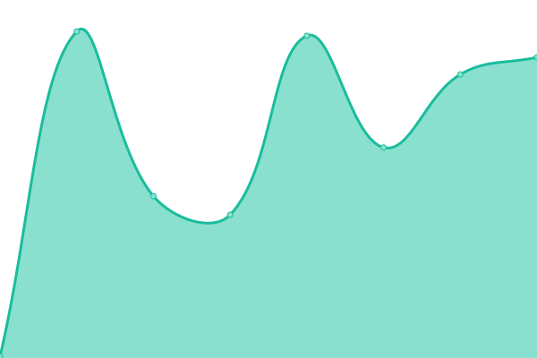

# [📈 Live Status](https://status.digitalmalayali.in): <!--live status--> **🟩 All systems operational**

This repository contains the open-source uptime monitor and status page for [Digital Malayali](https://www.digitalmalayali.in/), powered by [Upptime](https://github.com/upptime/upptime).

With [Upptime](https://upptime.js.org), you can get your own unlimited and free uptime monitor and status page, powered entirely by a GitHub repository. We use [Issues](https://github.com/digitalmalayali/status/issues) as incident reports, [Actions](https://github.com/digitalmalayali/status/actions) as uptime monitors, and [Pages](https://status.digitalmalayali.in) for the status page.

<!--start: status pages-->
<!-- This summary is generated by Upptime (https://github.com/upptime/upptime) -->
<!-- Do not edit this manually, your changes will be overwritten -->
<!-- prettier-ignore -->
| URL | Status | History | Response Time | Uptime |
| --- | ------ | ------- | ------------- | ------ |
|  [Digital Malayali - ML](https://digitalmalayali.in) | 🟩 Up | [digital-malayali-ml.yml](https://github.com/digitalmalayali/status/commits/HEAD/history/digital-malayali-ml.yml) | 

 1513ms
     
 | 

<a href="https://status.digitalmalayali.in/history/digital-malayali-ml">99.44%</a>
    

|  [Digital Malayali - EN](https://en.digitalmalayali.in) | 🟩 Up | [digital-malayali-en.yml](https://github.com/digitalmalayali/status/commits/HEAD/history/digital-malayali-en.yml) | 

 1445ms
     
 | 

<a href="https://status.digitalmalayali.in/history/digital-malayali-en">99.44%</a>
    

|  [Radio](https://radio.digitalmalayali.in/public/stream) | 🟩 Up | [radio.yml](https://github.com/digitalmalayali/status/commits/HEAD/history/radio.yml) | 

 649ms
     
 | 

<a href="https://status.digitalmalayali.in/history/radio">84.42%</a>
    

|  [Memes](https://memes.digitalmalayali.in) | 🟩 Up | [memes.yml](https://github.com/digitalmalayali/status/commits/HEAD/history/memes.yml) | 

 140ms
     
 | 

<a href="https://status.digitalmalayali.in/history/memes">99.37%</a>
    

|  [Product Raid](https://productraid.com/) | 🟩 Up | [product-raid.yml](https://github.com/digitalmalayali/status/commits/HEAD/history/product-raid.yml) | 

 1069ms
     
 | 

<a href="https://status.digitalmalayali.in/history/product-raid">99.50%</a>
    

|  [Privacy Policy Generator](https://free-privacy-policy-generator.digitalmalayali.in) | 🟩 Up | [privacy-policy-generator.yml](https://github.com/digitalmalayali/status/commits/HEAD/history/privacy-policy-generator.yml) | 

 163ms
     
 | 

<a href="https://status.digitalmalayali.in/history/privacy-policy-generator">99.36%</a>
    

|  [Malayalam Privacy Policy Generator](https://malayalam-privacy-policy-generator.digitalmalayali.in) | 🟩 Up | [malayalam-privacy-policy-generator.yml](https://github.com/digitalmalayali/status/commits/HEAD/history/malayalam-privacy-policy-generator.yml) | 

 129ms
     
 | 

<a href="https://status.digitalmalayali.in/history/malayalam-privacy-policy-generator">99.12%</a>
    

|  [Pappadam](https://pappadam.digitalmalayali.in) | 🟩 Up | [pappadam.yml](https://github.com/digitalmalayali/status/commits/HEAD/history/pappadam.yml) | 

 127ms
     
 | 

<a href="https://status.digitalmalayali.in/history/pappadam">92.93%</a>
    

|  [Malayalam Invoice Generator](https://malayalam-invoice-generator.digitalmalayali.in) | 🟩 Up | [malayalam-invoice-generator.yml](https://github.com/digitalmalayali/status/commits/HEAD/history/malayalam-invoice-generator.yml) | 

 136ms
     
 | 

<a href="https://status.digitalmalayali.in/history/malayalam-invoice-generator">99.36%</a>
    

<!--end: status pages-->

[**Visit our status website →**](https://status.digitalmalayali.in)

## 📄 License

- Powered by: [Upptime](https://github.com/upptime/upptime)
- Code: [MIT](./LICENSE) © [Digital Malayali](https://www.digitalmalayali.in/)
- Data in the `./history` directory: [Open Database License](https://opendatacommons.org/licenses/odbl/1-0/)
