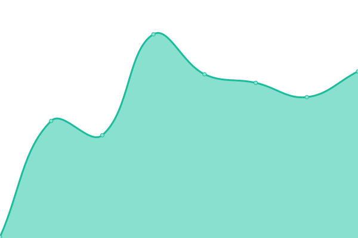
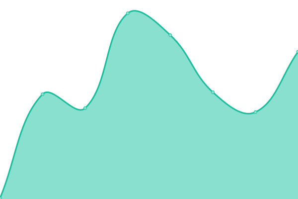

# [📈 Live Status](https://status.digitalmalayali.in): <!--live status--> **🟩 All systems operational**

This repository contains the open-source uptime monitor and status page for [Digital Malayali](https://links.digitalmalayali.in/), powered by [Upptime](https://github.com/upptime/upptime).

With [Upptime](https://upptime.js.org), you can get your own unlimited and free uptime monitor and status page, powered entirely by a GitHub repository. We use [Issues](https://github.com/digitalmalayali/status/issues) as incident reports, [Actions](https://github.com/digitalmalayali/status/actions) as uptime monitors, and [Pages](https://status.digitalmalayali.in) for the status page.

<!--start: status pages-->
<!-- This summary is generated by Upptime (https://github.com/upptime/upptime) -->
<!-- Do not edit this manually, your changes will be overwritten -->
<!-- prettier-ignore -->
| URL | Status | History | Response Time | Uptime |
| --- | ------ | ------- | ------------- | ------ |
|  [Digital Malayali - ML](https://digitalmalayali.in) | 🟩 Up | [digital-malayali-ml.yml](https://github.com/digitalmalayali/status/commits/HEAD/history/digital-malayali-ml.yml) | 

 486ms
     
 | 

<a href="https://status.digitalmalayali.in/history/digital-malayali-ml">100.00%</a>
    

|  [Digital Malayali - EN](https://en.digitalmalayali.in) | 🟩 Up | [digital-malayali-en.yml](https://github.com/digitalmalayali/status/commits/HEAD/history/digital-malayali-en.yml) | 

 899ms
     
 | 

<a href="https://status.digitalmalayali.in/history/digital-malayali-en">100.00%</a>
    

|  [Radio](https://radio.digitalmalayali.in/public/stream) | 🟩 Up | [radio.yml](https://github.com/digitalmalayali/status/commits/HEAD/history/radio.yml) | 

 366ms
     
 | 

<a href="https://status.digitalmalayali.in/history/radio">100.00%</a>
    

|  [Digital Malayali Studio](https://studio.digitalmalayali.in/) | 🟩 Up | [digital-malayali-studio.yml](https://github.com/digitalmalayali/status/commits/HEAD/history/digital-malayali-studio.yml) | 

 175ms
     
 | 

<a href="https://status.digitalmalayali.in/history/digital-malayali-studio">100.00%</a>
    

|  [Memes](https://memes.digitalmalayali.in) | 🟩 Up | [memes.yml](https://github.com/digitalmalayali/status/commits/HEAD/history/memes.yml) | 

 155ms
     
 | 

<a href="https://status.digitalmalayali.in/history/memes">100.00%</a>
    

|  [Privacy Policy Generator](https://free-privacy-policy-generator.digitalmalayali.in) | 🟩 Up | [privacy-policy-generator.yml](https://github.com/digitalmalayali/status/commits/HEAD/history/privacy-policy-generator.yml) | 

 166ms
     
 | 

<a href="https://status.digitalmalayali.in/history/privacy-policy-generator">100.00%</a>
    

|  [Malayalam Privacy Policy Generator](https://malayalam-privacy-policy-generator.digitalmalayali.in) | 🟩 Up | [malayalam-privacy-policy-generator.yml](https://github.com/digitalmalayali/status/commits/HEAD/history/malayalam-privacy-policy-generator.yml) | 

 183ms
     
 | 

<a href="https://status.digitalmalayali.in/history/malayalam-privacy-policy-generator">100.00%</a>
    

|  [Pappadam](https://pappadam.digitalmalayali.in) | 🟩 Up | [pappadam.yml](https://github.com/digitalmalayali/status/commits/HEAD/history/pappadam.yml) | 

 198ms
     
 | 

<a href="https://status.digitalmalayali.in/history/pappadam">100.00%</a>
    

|  [Malayalam Invoice Generator](https://malayalam-invoice-generator.digitalmalayali.in) | 🟩 Up | [malayalam-invoice-generator.yml](https://github.com/digitalmalayali/status/commits/HEAD/history/malayalam-invoice-generator.yml) | 

 204ms
     
 | 

<a href="https://status.digitalmalayali.in/history/malayalam-invoice-generator">100.00%</a>
    

<!--end: status pages-->

[**Visit our status website →**](https://status.digitalmalayali.in)

## 📄 License

- Powered by: [Upptime](https://github.com/upptime/upptime)
- Code: [MIT](./LICENSE) © [Anand Chowdhary](https://anandchowdhary.com), supported by [Pabio](https://pabio.com)
- Data in the `./history` directory: [Open Database License](https://opendatacommons.org/licenses/odbl/1-0/)
